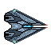
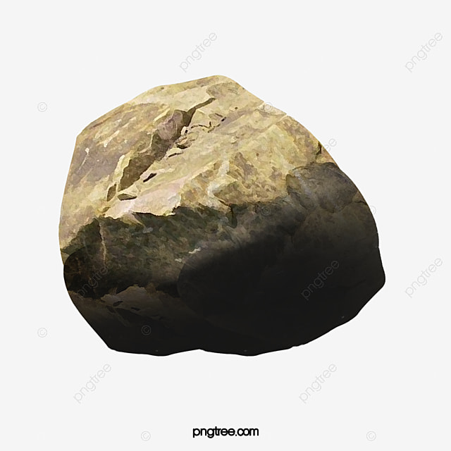
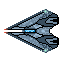

<h1 align="center">
  
        War's Plane 
    
  
</h1>

### Chào mừng bạn đến với “War's Plane: Chiến Đấu Trên Bầu Trời”! 🚀🌌

“War's Plane” là một tựa game bắn máy bay đơn giản, hấp dẫn, được viết bằng ngôn ngữ C++ và sử dụng thư viện SDL2 để tạo ra trải nghiệm đỉnh cao trên bầu trời. Trong War's Plane, bạn sẽ được trải nghiệm cảm giác hồi hộp, gay cấn khi tham gia vào những trận đại chiến không ngừng nghỉ giữa các đội máy bay chiến đấu.

#Video Demo: [Youtube.com](https://www.facebook.com/ThePhappp)

## 1. Mô tả chung  
### Các đối tượng trong Game

-  *Player* là nhân vật chính của trò chơi. Player có thể di chuyển theo 4 hướng lên/xuống/trái/phải theo sự điều khiển của người chơi.
-  *Enemy (Obstacle)* là các đối tượng mà Player phải tiêu diệt. Enemy xuất hiện ngẫu nhiên và có tốc độ di chuyển ngẫu nhiêu.
-  *Boss* là đối tượng mà Player phải tiêu diệt. Boss có thể di chuyển lên xuống và có thể bắn ra đạn ngẫu nhiên.
-     *Bullet* là đối tượng mà cả Player và Boss đều có thể bắn ra. Player có thể bắn  Bullet liên tục bằng nút SPACE, còn Boss bắn  Bullet với rate ngẫu nhiên. Bullet của Boss luôn bay theo hướng từ phải sang trái.
-  Mạng của người chơi, điểm số.
### Hướng dẫn chơi

- Nhấp chuột vào Play để bắt đầu trò chơi.
- Di chuyển Player bằng các nút mũi tên ↑ ↓ ← → và bắn đạn bằng nút SPACE.
- Trong một màn chơi, Player sẽ được người chơi di chuyển, bắn hạ kẻ địch, đồng thời né đạn và mỗi lần bắn hạ Enemy sẽ được 100 points.
- Player sẽ có 3 mạng  và sẽ mất 1 mạng khi va chạm với Enemy, bị trúng đạn của Boss hoặc bắn miss 4 lần. Khi mạng của Player bằng 0 trò chơi kết thúc.
- Enemy bị tiêu diệt khi trúng đạn của Player.
- Boss sẽ giảm máu sau mỗi lần bị Player bắn trúng và sẽ bị tiêu diệt khi hết máu.

### Nhiệm vụ

- Bắn các đối tượng quái  để lấy điểm.
- Tiêu diệt boss  để chiến thắng.

### Các cấu trúc chính trong Game
- Game.cpp: hàm chính của game, thực hiện các nhiệm vụ chính.
- Bullet.cpp: Hàm tạo đạn cho Player và xử lý các thao tác với đạn.
- BossObject.cpp: hàm tạo ra Boss có thể di chuyển, bắn ra đạn.
- ExplosionObject: hàm khởi tạo và render explosion khi Player va chạm hoặc Boss die.
- Collision.cpp: hàm check va chạm.
- Control.cpp: gồm các hàm xử lý sự kiện.
- ImageLoad.cpp: gồm các hàm phục vụ cho việc load ảnh, âm thanh, tft.

 ## 2. Hướng dẫn tải game
 - Click "Download" to download file .zip: [Download](https://github.com/ThePhapp/PRJ/releases/download/release/New.folder.zip)
 - Giải nén file .zip
 - Chạy file main.exe

 ## 3. Kỹ thuật lập trình  
 
### Xây dựng trên nền tảng C++ và SDL2 bao gồm
- SDL_Mixer: Hỗ trợ xử lý âm thanh.
- SDL_Ttf: Hỗ trợ xử lý fonts chữ.
- Các thư viện mở rộng C++.
- IDE Visual Studio Code.

### Các kỹ năng áp dụng lập trình
 - Các kĩ thuật lập trình C++ cơ bản ( Struct, class, vector, vòng lặp,... )
 - Biến (static, extern), vòng lặp, cấu trúc rẽ nhánh, mảng, chuỗi.
 - Kỹ thuật kiểm tra xử lý va chạm.
 - Tách file quản lý code.
 - Sử dụng SDL2, SDL2_Image, SDL2_TTF, SDL2_Mixer.

### Nguồn tham khảo
- [Lazyfoo](https://lazyfoo.net/tutorials/SDL/)
